# BRD — QR Attend (Sistem Presensi Mahasiswa Berbasis QR)

| Item | Keterangan |
|---|---|
| Dokumen | Business Requirements Document (BRD) |
| Produk | QR Attend — Aplikasi Presensi Mahasiswa dengan Pindai QR + Validasi Lokasi |
| Institusi | Universitas Pamulang · Fakultas Ilmu Komputer · Program Studi Sistem Informasi |
| Versi | 1.0 |
| Tanggal | 3 Oktober 2026 |
| Penyusun | Anang |
| Acuan | Desain QR Attend (canvas), Flowchart & Activity Diagram Presensi QR |
| Stack rencana | Laravel (terbaru) · MySQL · WebSocket · shadcn/ui · VPS |

---

## Daftar Isi

1. [Ringkasan](#1-ringkasan)
2. [Ruang Lingkup](#2-ruang-lingkup)
3. [Aktor & Hak Akses](#3-aktor--hak-akses)
4. [Glosarium](#4-glosarium)
5. [Alur Bisnis](#5-alur-bisnis)
6. [Siklus Status (State Machine)](#6-siklus-status-state-machine)
7. [Aturan Bisnis](#7-aturan-bisnis)
8. [Kebutuhan Fungsional per Modul](#8-kebutuhan-fungsional-per-modul)
9. [Rancangan ERD](#9-rancangan-erd)
10. [Kamus Data](#10-kamus-data)
11. [Rumus & Perhitungan](#11-rumus--perhitungan)
12. [Kebutuhan Non-Fungsional](#12-kebutuhan-non-fungsional)
13. [Notifikasi](#13-notifikasi)
14. [Laporan & Ekspor](#14-laporan--ekspor)
15. [Peta Halaman](#15-peta-halaman)
16. [Catatan Arsitektur (Laravel)](#16-catatan-arsitektur-laravel)
17. [Asumsi, Risiko & Pertanyaan Terbuka](#17-asumsi-risiko--pertanyaan-terbuka)
18. [Lampiran: Data Contoh](#18-lampiran-data-contoh)

---

## 1. Ringkasan

### 1.1 Latar belakang
Presensi kuliah masih dilakukan dengan tanda tangan kertas atau dipanggil satu per satu. Cara ini lambat, mudah dititipkan, dan rekapnya harus diketik ulang. Akibatnya kelayakan UAS (minimal 75% kehadiran) sering baru diketahui di akhir semester.

### 1.2 Tujuan bisnis

| Kode | Tujuan | Ukuran keberhasilan |
|---|---|---|
| G-01 | Mempercepat presensi di kelas | Presensi satu kelas selesai ≤ 20 menit tanpa memanggil nama |
| G-02 | Mencegah titip absen | Presensi hanya sah bila QR valid, mahasiswa di kelasnya, di dalam radius ruang, dari perangkat yang terikat |
| G-03 | Rekap kehadiran real-time | Dosen & admin melihat rekap per semester tanpa input ulang |
| G-04 | Kelayakan UAS terpantau sejak awal | Status Aman / Waspada / Tidak memenuhi tersedia setiap pertemuan |
| G-05 | Izin/sakit terdokumentasi | Pengajuan, lampiran, dan keputusan dosen tercatat dan mengubah status presensi otomatis |

### 1.3 Ringkasan solusi
Dosen membuka sesi presensi pada jam kuliah → sistem membuat **QR sekali per sesi yang berlaku 20 menit** → mahasiswa memindai dari ponselnya → sistem memvalidasi **8 lapis** (login, QR, sesi, kelas, jadwal, duplikasi, akurasi lokasi, radius ruang) → presensi tercatat **Hadir/Terlambat** secara real-time. Yang tidak hadir bisa mengajukan **izin/sakit** untuk disetujui dosen. Semua data mengalir ke **Rekap Kehadiran** dan **Laporan Presensi**.

---

## 2. Ruang Lingkup

### 2.1 Termasuk (MVP)
- Autentikasi: masuk (deteksi peran otomatis), daftar (Mahasiswa/Dosen, email bebas tanpa verifikasi), persetujuan akun oleh admin.
- Ikat perangkat mahasiswa + permintaan reset perangkat.
- Master data: Periode Akademik, Mahasiswa, Dosen, Mata Kuliah, Kelas, Ruang & Titik Presensi.
- Pemetaan Kelas (sumber tunggal jadwal) dan Jadwal Akademik (read-only).
- Sesi presensi QR (dosen), pemindaian & validasi (mahasiswa), presensi manual.
- Pengajuan izin/sakit (mahasiswa) dan persetujuan (dosen).
- Rekap kehadiran per semester + batas minimal UAS.
- Laporan presensi + ekspor Excel/PDF.
- Pengaturan kebijakan presensi.
- Profil (Admin/Dosen dan Mahasiswa).

### 2.2 Tidak termasuk (di luar MVP)
- Integrasi otomatis dengan SIAKAD/PDDikti (data master diisi admin atau impor).
- Presensi dosen (kehadiran mengajar) dan honorarium.
- Mahasiswa mengulang mata kuliah di kelas lain (lihat [Asumsi A-03](#171-asumsi)).
- Aplikasi native; mahasiswa memakai web responsif (mobile), dosen & admin desktop.
- Push notification ke ponsel maupun email; MVP ini hanya memakai notifikasi in-app (badge, kartu, pesan flash).

---

## 3. Aktor & Hak Akses

### 3.1 Aktor

| Aktor | Deskripsi | Cara mendapat akun |
|---|---|---|
| **Admin** (Bagian Akademik) | Mengelola master data, periode, pemetaan, laporan, pengaturan, persetujuan akun dosen & reset perangkat | Dibuat langsung di database (seeder) — tidak ada pendaftaran publik |
| **Dosen** | Membuka sesi presensi, presensi manual, menyetujui izin, melihat rekap mata kuliah yang diampu | Daftar → menunggu persetujuan admin prodi |
| **Mahasiswa** | Memindai QR, melihat riwayat, mengajukan izin/sakit, mengelola profil | Daftar → menunggu persetujuan admin akademik → ikat perangkat saat masuk pertama |
| **Sistem** | Membuat sesi terjadwal, menutup sesi kedaluwarsa, menandai Tidak Hadir, menghitung rekap, mengirim notifikasi | — |

### 3.2 Matriks hak akses

Legenda: **C** buat · **R** lihat · **U** ubah · **D** hapus · **A** setujui/tolak · — tidak ada akses

| Modul | Admin | Dosen | Mahasiswa |
|---|---|---|---|
| Periode Akademik | CRUD | R (aktif) | R (aktif) |
| Mahasiswa | CRUD | R (kelas yang diajar) | R (diri sendiri) |
| Dosen | CRUD + A (akun baru) | R (diri sendiri) | — |
| Mata Kuliah / Kelas | CRUD | R (yang diampu) | R (kelasnya) |
| Ruang & Titik Presensi | CRUD | R | R (saat pindai) |
| Pemetaan Kelas | CRUD (periode tidak Selesai) | — | — |
| Jadwal Akademik | R | R (jadwal sendiri) | R (Kelas Hari Ini) |
| Sesi Presensi (buka QR) | R | C/R (sesi miliknya) | — |
| Presensi (pindai) | R | R | C (dirinya) |
| Presensi Manual | R | U (sesi miliknya) | — |
| Pengajuan Izin/Sakit | R | A (mata kuliah yang diampu) | C/R/batal (miliknya) |
| Rekap Kehadiran | R (semua) | R (mata kuliah yang diampu) | R (dirinya, di riwayat) |
| Laporan Presensi + Ekspor | R + ekspor | R (riwayat sesi) | — |
| Reset Perangkat | A | — | C/batal |
| Pengaturan | U | R | — |

---

## 4. Glosarium

| Istilah | Arti |
|---|---|
| Periode Akademik | Satu semester (Ganjil/Genap/Antara) dalam satu tahun ajaran, mis. Ganjil 2026/2027 |
| Pemetaan Kelas | Penugasan mata kuliah + dosen + ruang + hari/jam ke sebuah kelas dalam satu periode. Sumber tunggal jadwal |
| Pertemuan | Satu dari 16 tatap muka sebuah pemetaan |
| Sesi Presensi | Jendela 20 menit sejak dosen menekan "Mulai Presensi" pada satu pertemuan |
| Titik Presensi | Koordinat (latitude, longitude) + radius sebuah ruang tempat QR ditayangkan |
| Akurasi lokasi | Perkiraan galat GPS perangkat (meter). Semakin kecil semakin tepat |
| Ikat perangkat | Akun mahasiswa hanya sah dipakai presensi dari satu perangkat |
| H / T / I / A | Hadir / Terlambat / Izin (termasuk sakit yang disetujui) / Alpa (Tidak Hadir) |
| Jatah absen | Jumlah maksimal Alpa agar tetap layak UAS (16 − ⌈75% × 16⌉ = **4**) |

---

## 5. Alur Bisnis

### 5.1 Gambaran besar

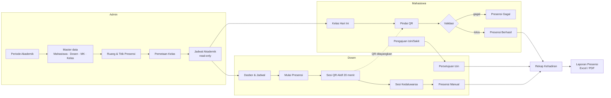

Urutan siklus satu semester:

1. **Persiapan** (admin, sebelum semester): buat periode → pastikan master lengkap → atur titik presensi tiap ruang → petakan kelas (atau salin dari periode sebelumnya) → aktifkan periode.
2. **Perkuliahan** (minggu 1–16): dosen membuka sesi tiap pertemuan → mahasiswa memindai → yang gagal dibantu presensi manual → izin/sakit diajukan & diproses.
3. **Pemantauan** (berjalan): dasbor & rekap menunjukkan mahasiswa Waspada / Tidak memenuhi.
4. **Penutupan** (akhir semester): rekap final Memenuhi / Tidak memenuhi → laporan diekspor → periode diubah menjadi Selesai (pemetaan terkunci).

### 5.2 Registrasi, verifikasi, dan masuk

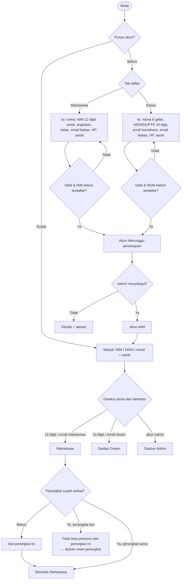

Catatan:
- Peran ditentukan dari data akun di database; pola identitas hanya membantu memilih kolom pencarian (NIM / NIDN / email).
- Email tidak dikunci ke domain kampus dan tidak memerlukan verifikasi — gerbang aktivasi akun sepenuhnya di tangan admin (persetujuan), bukan email.
- Tidak ada fitur lupa kata sandi; pengguna yang lupa sandi menghubungi admin untuk direset manual.

### 5.3 Persiapan akademik (Admin)

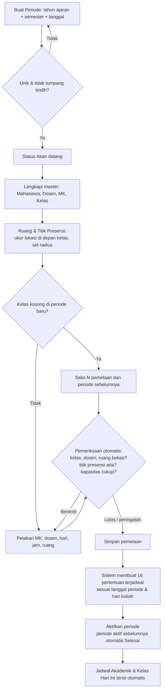

### 5.4 Sesi presensi (Dosen)

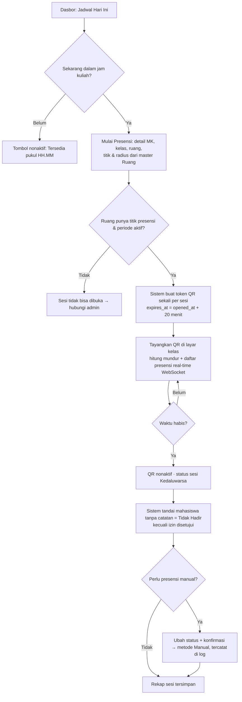

### 5.5 Pemindaian & validasi (Mahasiswa)

Validasi dijalankan **berurutan**, berhenti di pemeriksaan pertama yang gagal. Pemeriksaan sesudahnya ditampilkan "Tidak dicek".

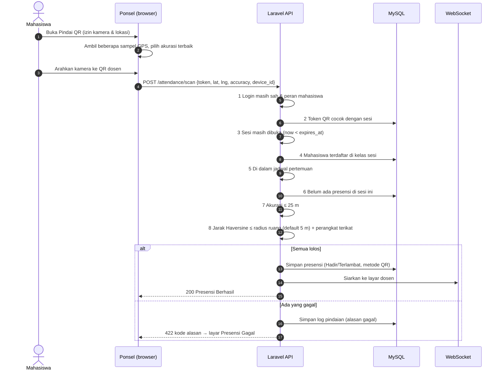

| Urutan | Pemeriksaan | Kode gagal | Layar & tindakan |
|---|---|---|---|
| 1 | Masuk sebagai mahasiswa | `unauthorized` | Perlu Masuk Ulang → Masuk |
| 2 | QR Code valid | `invalidQR` | QR Code Tidak Valid → Pindai lagi |
| 3 | Sesi masih dibuka | `expired` | Sesi Presensi Kedaluwarsa → minta presensi manual |
| 4 | Terdaftar di kelas ini | `wrongClass` | Bukan Kelas Anda → Kelas hari ini |
| 5 | Di dalam jadwal | `wrongSchedule` | Di Luar Jadwal Kuliah → Kelas hari ini |
| 6 | Belum pernah presensi | `duplicate` | Presensi Sudah Tercatat (info) → Detail presensi |
| 7 | Lokasi akurat (≤ 25 m) | `lowAccuracy` | Lokasi Kurang Akurat → nyalakan GPS, pindai ulang |
| 8 | Dalam radius ruang | `outsideRadius` | Presensi Gagal "± N m dari Ruang X" → mendekat, pindai ulang |

Gagal di nomor 2, 7, 8 → mahasiswa **boleh pindai ulang** selama sesi masih dibuka. Gagal di nomor 3, 4, 5 → tidak bisa diulang; jalur keluarnya presensi manual oleh dosen atau pengajuan izin.

### 5.6 Pengajuan izin/sakit & persetujuan

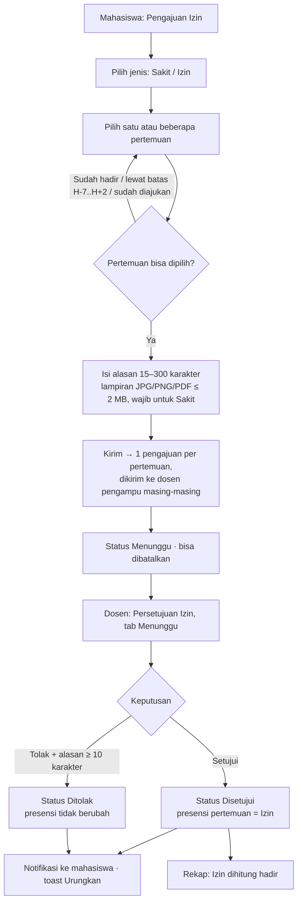

### 5.7 Rekap kehadiran & kelayakan UAS

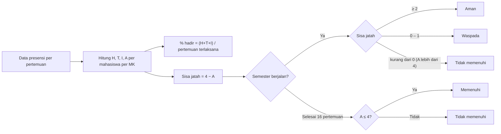

### 5.8 Reset perangkat

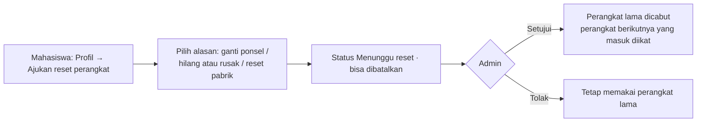

### 5.9 Kelola titik presensi ruang

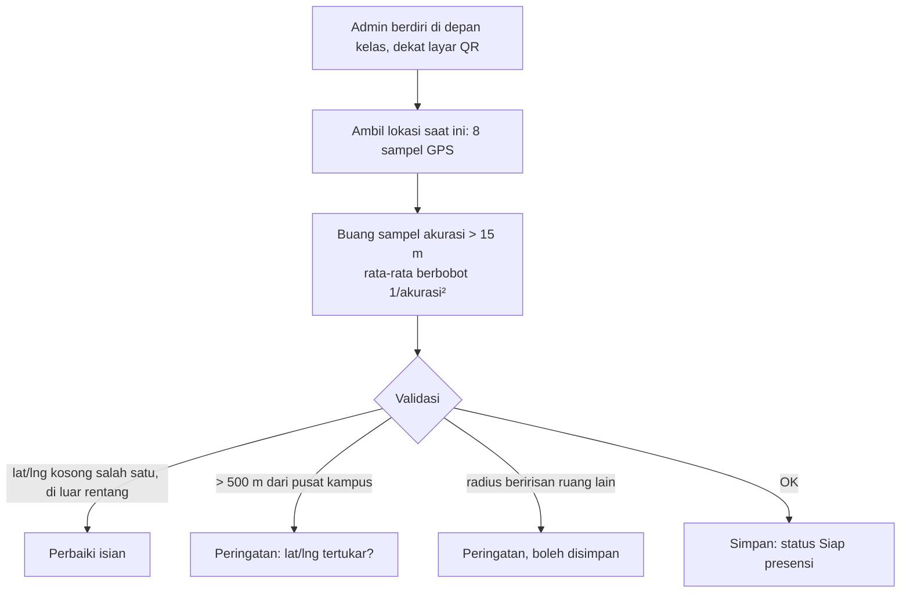

---

## 6. Siklus Status (State Machine)

### 6.1 Periode akademik
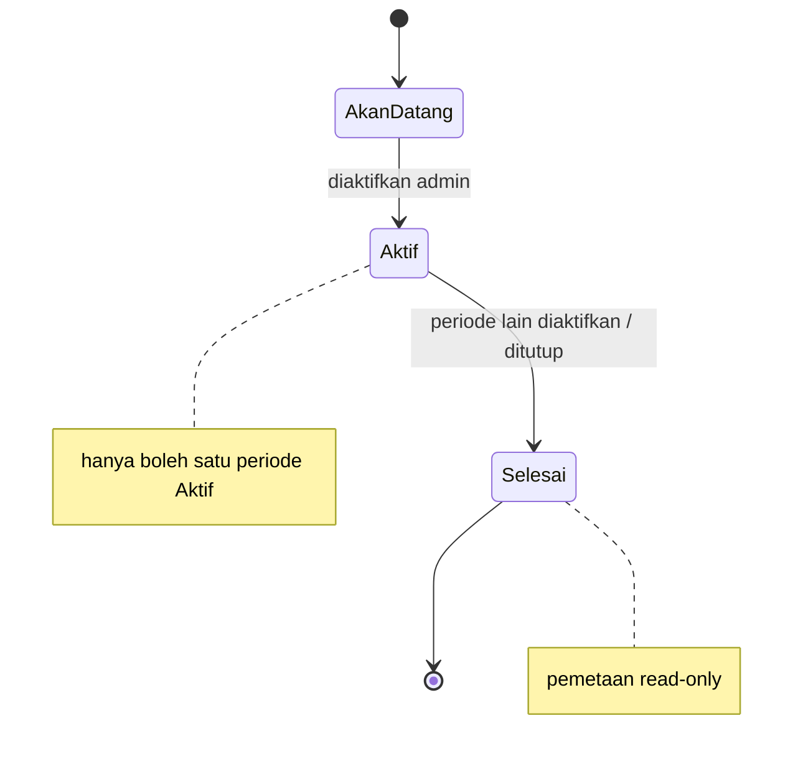

### 6.2 Sesi presensi (pertemuan)
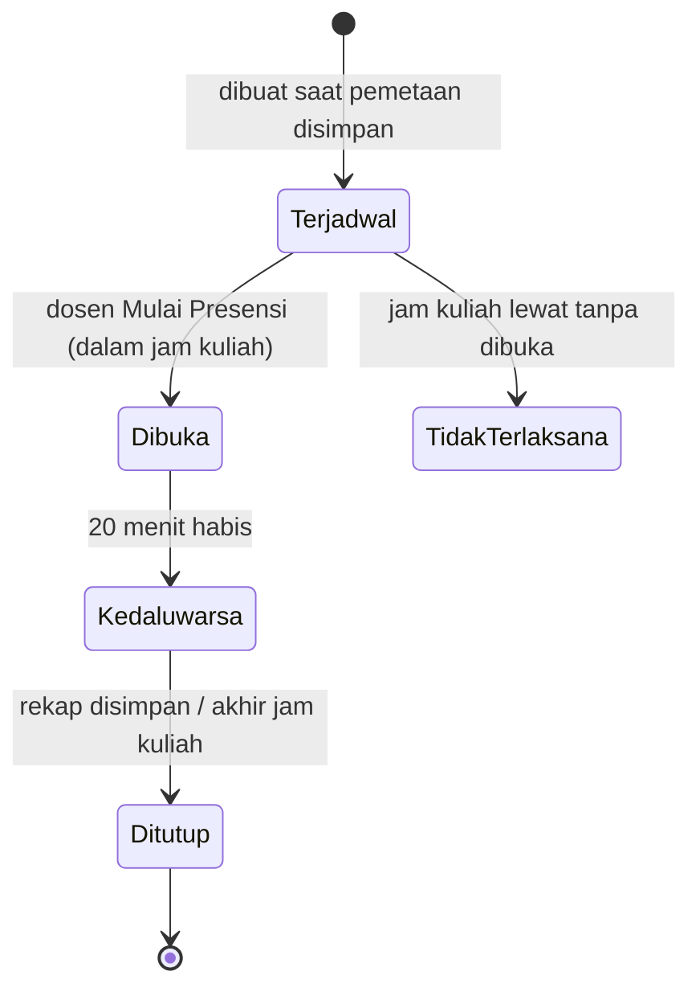

### 6.3 Presensi mahasiswa
| Status | Sumber | Bisa berubah ke |
|---|---|---|
| Hadir | Pindai QR sebelum batas terlambat, atau manual | Terlambat, Tidak Hadir, Izin (manual) |
| Terlambat | Pindai QR setelah batas terlambat, atau manual | Hadir, Tidak Hadir, Izin (manual) |
| Tidak Hadir | Otomatis saat sesi ditutup, atau manual | Izin (pengajuan disetujui / manual), Hadir/Terlambat (manual) |
| Izin | Pengajuan disetujui, atau manual | Status lain (manual, tercatat di log) |

### 6.4 Pengajuan izin/sakit
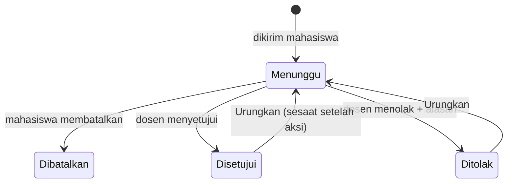

### 6.5 Akun & perangkat
- Akun: `Menunggu persetujuan` (mahasiswa & dosen) → `Aktif` → `Nonaktif` / `Ditolak`.
- Perangkat: `Terikat` → `Menunggu reset` → `Dicabut` (lalu perangkat baru `Terikat`).

---

## 7. Aturan Bisnis

| Kode | Aturan | Ditegakkan di |
|---|---|---|
| **BR-01** | QR hanya dibuat dosen, **sekali per sesi**, berlaku **20 menit**; tidak ada tombol perbarui | Sesi presensi |
| **BR-02** | Sesi hanya bisa dibuka pada **jam kuliah terjadwal** dan dalam **periode Aktif** | Mulai Presensi |
| **BR-03** | Sesi hanya bisa dibuka bila ruang punya **titik presensi** dan berstatus Aktif | Mulai Presensi |
| **BR-04** | Mahasiswa hanya presensi untuk **kelas & jadwalnya sendiri**, **sekali per sesi** | Validasi pindai |
| **BR-05** | Akurasi lokasi perangkat harus **≤ 25 m** | Validasi pindai |
| **BR-06** | Jarak (Haversine) ke titik ruang harus **≤ radius ruang** (default 5 m, rentang 3–50 m) | Validasi pindai |
| **BR-07** | Presensi QR hanya dari **perangkat terikat**; reset perangkat butuh persetujuan admin | Validasi pindai, Profil |
| **BR-08** | Pindaian setelah **N menit** sejak sesi dibuka (pilihan 5/10/15, default 15) tercatat **Terlambat** | Validasi pindai |
| **BR-09** | Saat sesi ditutup, mahasiswa tanpa catatan otomatis **Tidak Hadir**, kecuali izinnya sudah disetujui | Job sistem |
| **BR-10** | Setiap catatan presensi menyimpan **metode**: QR, Manual, atau Pengajuan | Presensi |
| **BR-11** | Presensi manual wajib **konfirmasi** dan tercatat di log perubahan (siapa, kapan, dari → ke) | Presensi Manual |
| **BR-12** | Pengajuan izin dalam jendela **H-7 s.d. H+2** dari tanggal pertemuan | Pengajuan Izin |
| **BR-13** | **Sakit** wajib lampiran surat; **Izin** lampiran opsional; JPG/PNG/PDF ≤ 2 MB | Pengajuan Izin |
| **BR-14** | Satu pengajuan aktif (Menunggu/Disetujui) per mahasiswa per pertemuan; pertemuan yang sudah Hadir/Terlambat tidak bisa diajukan | Pengajuan Izin |
| **BR-15** | Pengajuan diputuskan oleh **dosen pengampu**; menolak wajib alasan ≥ 10 karakter; disetujui → presensi jadi **Izin** | Persetujuan Izin |
| **BR-16** | Kelayakan UAS: minimal **75%** dari 16 pertemuan → maksimal **4 kali Tidak Hadir**; Hadir, Terlambat, Izin dihitung hadir | Rekap |
| **BR-17** | Hanya **satu periode Aktif**; mengaktifkan periode baru otomatis menjadikan yang lama Selesai | Periode Akademik |
| **BR-18** | Kombinasi tahun ajaran + semester **unik**; rentang tanggal periode **tidak boleh tumpang tindih** | Periode Akademik |
| **BR-19** | Jadwal punya **satu sumber kebenaran**: Pemetaan Kelas. Jadwal Akademik read-only | Pemetaan, Jadwal |
| **BR-20** | Bentrok dicek **dalam periode yang sama**: hari sama + jam beririsan pada kelas, dosen, atau ruang | Pemetaan Kelas |
| **BR-21** | Pemetaan pada periode **Selesai** tidak bisa ditambah/diubah/dihapus | Pemetaan Kelas |
| **BR-22** | Ruang Nonaktif tidak bisa dipetakan; ruang yang masih dipakai pemetaan tidak bisa dihapus/dinonaktifkan | Ruang & Titik |
| **BR-23** | Titik presensi maks. **500 m** dari pusat kampus; lat & lng diisi keduanya atau kosong keduanya | Ruang & Titik |
| **BR-24** | Data master yang sudah dipakai transaksi (mis. punya sesi presensi) **tidak bisa dihapus**, hanya dinonaktifkan | Semua master |
| **BR-25** | Akun Admin dibuat dari database; pendaftaran publik hanya Mahasiswa & Dosen; email bebas (tidak dikunci ke domain kampus, tanpa verifikasi email); keduanya berstatus **Menunggu** sampai disetujui admin, baru bisa masuk | Auth |
| **BR-26** | Kata sandi min. 8 karakter, berisi huruf besar, huruf kecil, dan angka; sandi baru ≠ sandi lama | Auth, Profil |
| **BR-28** | Email terkunci (tidak bisa diubah pengguna); No. HP format 08…, 10–13 digit | Profil |

---

## 8. Kebutuhan Fungsional per Modul

### 8.1 Autentikasi (FR-AUTH)
| Kode | Kebutuhan |
|---|---|
| FR-AUTH-01 | Masuk dengan satu kolom identitas (NIM / NIDN / email) + kata sandi, tanpa tab peran dan tanpa "tetap masuk" |
| FR-AUTH-02 | Daftar dengan tab Mahasiswa / Dosen, validasi per kolom, ringkasan galat di atas form, persetujuan (consent) wajib |
| FR-AUTH-03 | Mahasiswa & Dosen berstatus Menunggu setelah daftar; admin menyetujui/menolak dari panel Mahasiswa/Dosen masing-masing sebelum akun bisa masuk |
| FR-AUTH-05 | Ikat perangkat saat mahasiswa pertama kali masuk |

### 8.2 Master data (FR-MST)
| Kode | Kebutuhan |
|---|---|
| FR-MST-01 | CRUD Periode Akademik dengan validasi unik, tidak tumpang tindih, satu Aktif |
| FR-MST-02 | CRUD Mahasiswa, Dosen, Mata Kuliah, Kelas: pencarian, filter, panel detail, konfirmasi hapus, Urungkan, paginasi |
| FR-MST-03 | CRUD Ruang & Titik Presensi: ambil lokasi (multi-sampel), input manual lat/lng, radius, pratinjau peta, tautan Google Maps |
| FR-MST-04 | Penjaga hapus: data yang sudah dipakai ditolak dengan pesan jelas |

### 8.3 Penjadwalan (FR-SCH)
| Kode | Kebutuhan |
|---|---|
| FR-SCH-01 | Pemetaan Kelas per periode: pilih kelas → petakan MK, dosen (difilter yang mengampu), hari, jam (otomatis dari SKS), ruang |
| FR-SCH-02 | Pemeriksaan otomatis langsung: kelas/dosen/ruang bebas, titik presensi ada, kapasitas ruang ≥ jumlah mahasiswa |
| FR-SCH-03 | Salin pemetaan dari periode sebelumnya untuk kelas kosong |
| FR-SCH-04 | Saat pemetaan disimpan, sistem membuat 16 pertemuan terjadwal |
| FR-SCH-05 | Jadwal Akademik read-only dengan filter periode, hari, kelas, dosen |

### 8.4 Presensi (FR-ATT)
| Kode | Kebutuhan |
|---|---|
| FR-ATT-01 | Dosen membuka sesi → QR + hitung mundur + penghitung Hadir/Belum/Total + tabel real-time |
| FR-ATT-02 | Sesi otomatis berubah ke Kedaluwarsa saat waktu habis |
| FR-ATT-03 | Mahasiswa memindai QR; validasi 8 lapis; hasil Berhasil atau Gagal (8 varian) dengan checklist hasil validasi |
| FR-ATT-04 | Presensi manual oleh dosen dengan dialog konfirmasi |
| FR-ATT-05 | Riwayat presensi mahasiswa (filter tanggal, MK, kelas, status) + detail presensi |
| FR-ATT-06 | Riwayat sesi dosen (filter rentang tanggal, MK, kelas) |
| FR-ATT-07 | Semua pindaian (berhasil & gagal) tercatat di log untuk audit |

### 8.5 Izin/sakit (FR-LV)
| Kode | Kebutuhan |
|---|---|
| FR-LV-01 | Form pengajuan: jenis, multi-pilih pertemuan (dikelompokkan per tanggal, yang terkunci diberi tanda), alasan, lampiran |
| FR-LV-02 | Daftar "Pengajuan saya" dengan status dan catatan dosen; batalkan saat Menunggu |
| FR-LV-03 | Dosen: tab Menunggu/Disetujui/Ditolak, filter MK, pratinjau lampiran, indikator risiko kehadiran |
| FR-LV-04 | Setujui / Tolak (alasan cepat + alasan wajib) dengan Urungkan |

### 8.6 Rekap & laporan (FR-RPT)
| Kode | Kebutuhan |
|---|---|
| FR-RPT-01 | Rekap per periode + MK + kelas: strip 16 pertemuan, H/T/I/A, % hadir, sisa jatah, status; urut risiko |
| FR-RPT-02 | Rekap versi dosen dibatasi ke MK & kelas yang diampu |
| FR-RPT-03 | Laporan presensi dengan filter 2 baris × 3 kolom (Periode, Tanggal, MK / Kelas, Dosen, Status), pratinjau cetak |
| FR-RPT-04 | Ekspor Excel & PDF; nonaktif bila data kosong |

### 8.7 Dasbor, profil, pengaturan (FR-GEN)
| Kode | Kebutuhan |
|---|---|
| FR-GEN-01 | Dasbor Admin: 6 kartu statistik + grafik tren, per MK, per kelas, bulanan |
| FR-GEN-02 | Dasbor Dosen: kartu aksi (izin menunggu, risiko UAS), statistik, jadwal hari ini, sesi berlangsung |
| FR-GEN-03 | Beranda Mahasiswa: kelas saat ini + tombol pindai, ringkasan kehadiran, status pengajuan |
| FR-GEN-04 | Profil Mahasiswa: identitas (read-only), kontak, perangkat presensi, ubah kata sandi |
| FR-GEN-05 | Profil Admin/Dosen: identitas, data pribadi, keamanan (sandi, perangkat masuk) |
| FR-GEN-06 | Pengaturan kebijakan: masa berlaku QR, pembuatan QR, radius default, batas akurasi, batas terlambat, hanya jam kuliah, presensi manual, ringkasan email, batas kehadiran, batas pengajuan izin |

---

## 9. Rancangan ERD

### 9.1 Diagram

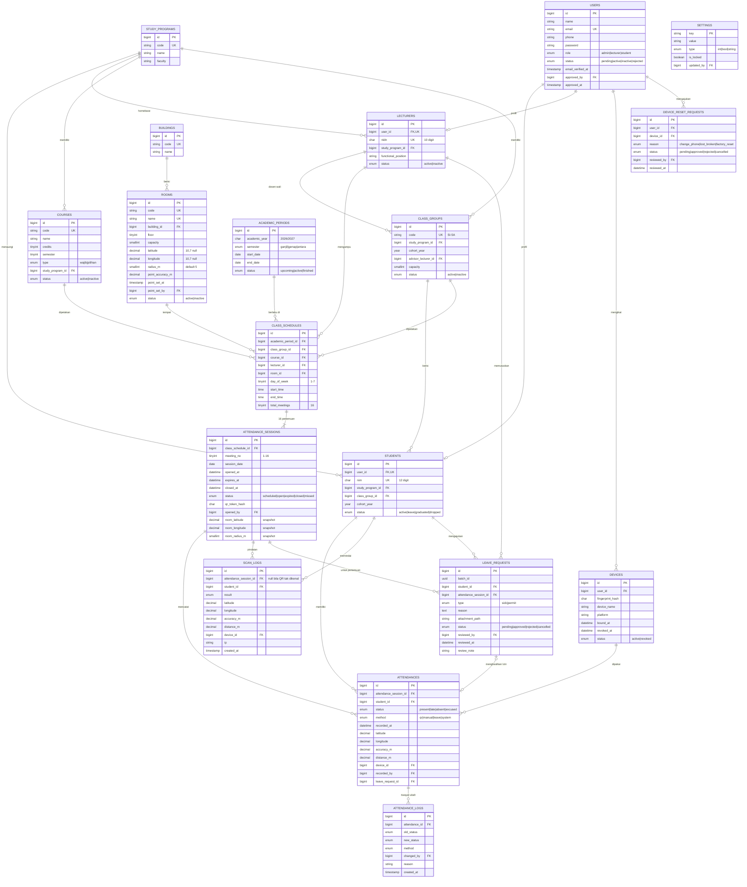

### 9.2 Keputusan desain ERD (dan alasannya)

| Keputusan | Alasan |
|---|---|
| `users` dipisah dari `students` / `lecturers` | Satu tabel login untuk semua peran; data akademik tiap peran berbeda. Admin cukup di `users` (role=admin) |
| Nama tabel `class_groups` (bukan `classes`) | `Class` adalah kata kunci PHP, jadi model `Class` tidak bisa dibuat di Laravel |
| `class_schedules` = **Pemetaan Kelas** | Satu baris = satu MK di satu kelas pada satu periode. Jadwal Akademik cukup **query/view** dari tabel ini (BR-19), tidak ada tabel jadwal terpisah |
| 16 `attendance_sessions` dibuat di muka | Pengajuan izin H-7 butuh pertemuan yang sudah ada; rekap bisa menampilkan pertemuan "belum terlaksana" |
| **Snapshot** lat/lng/radius ruang di sesi | Bila titik ruang diukur ulang, presensi lama tetap bisa diaudit dengan titik yang berlaku saat itu |
| Token QR disimpan sebagai **hash** | Bila database bocor, token tidak bisa dipakai ulang |
| `scan_logs` terpisah dari `attendances` | `attendances` hanya berisi hasil sah (unik per sesi × mahasiswa); percobaan gagal tetap terekam untuk audit titip absen |
| `attendance_logs` | Jejak setiap perubahan manual / persetujuan izin (siapa, kapan, dari → ke) |
| `leave_requests.batch_id` | Satu kali kirim multi-pertemuan menjadi beberapa baris, tetapi tetap bisa dikelompokkan |
| Rekap **tidak** disimpan sebagai tabel | Dihitung dari `attendances` (sumber tunggal). Bila lambat, tambahkan tabel cache yang diperbarui lewat event — bukan sumber data utama |
| `settings` key-value | Kebijakan (20 menit, 25 m, 75%, H-7/H+2, terlambat 15 menit) bisa diubah tanpa deploy; item terkunci ditandai `is_locked` |

### 9.3 Indeks & constraint penting

| Tabel | Constraint / indeks | Tujuan |
|---|---|---|
| academic_periods | `UNIQUE(academic_year, semester)` | BR-18 |
| class_schedules | `UNIQUE(academic_period_id, class_group_id, course_id)` | Satu MK sekali per kelas per periode |
| class_schedules | `INDEX(academic_period_id, day_of_week, room_id)`, `(…, lecturer_id)`, `(…, class_group_id)` | Cek bentrok cepat (BR-20) |
| attendance_sessions | `UNIQUE(class_schedule_id, meeting_no)` | Tidak ada pertemuan ganda |
| attendance_sessions | `INDEX(session_date, status)` | Jadwal Hari Ini, job penutupan sesi |
| attendances | `UNIQUE(attendance_session_id, student_id)` | Sekali per sesi (BR-04), juga pengaman race condition |
| leave_requests | `INDEX(student_id, attendance_session_id, status)` | Cek satu pengajuan aktif (BR-14)* |
| devices | `INDEX(user_id, status)` | Cek perangkat aktif |
| scan_logs | `INDEX(student_id, created_at)` | Audit & batas laju |

\* MySQL tidak punya partial unique index. BR-14 ditegakkan di aplikasi dalam transaksi + `SELECT … FOR UPDATE`, atau dengan kolom generated `active_key = IF(status IN ('pending','approved'), CONCAT(student_id,'-',attendance_session_id), NULL)` yang diberi `UNIQUE`.

### 9.4 Aturan relasi saat hapus
- Master yang sudah dipakai: **RESTRICT** (BR-24) → UI menampilkan "tidak bisa dihapus", sarankan Nonaktif.
- `attendances` → `attendance_logs`: CASCADE (log ikut induknya; dalam praktik presensi tidak dihapus).
- `users` dihapus: tidak diizinkan bila punya data presensi; gunakan status `inactive`.

---

## 10. Kamus Data

Kolom `created_at` / `updated_at` ada di semua tabel kecuali disebut lain.

### 10.1 users
| Kolom | Tipe | Wajib | Keterangan |
|---|---|---|---|
| id | BIGINT UNSIGNED PK | ✔ | |
| name | VARCHAR(150) | ✔ | Untuk dosen termasuk gelar, mis. "Gusmayeni, S.Kom., M.Kom" |
| email | VARCHAR(150) UNIQUE | ✔ | Bebas (tidak dikunci ke domain kampus); tidak perlu verifikasi |
| phone | VARCHAR(13) | | 08…, 10–13 digit |
| password | VARCHAR(255) | ✔ | bcrypt/argon2 |
| role | ENUM('admin','lecturer','student') | ✔ | |
| status | ENUM('pending','active','inactive','rejected') | ✔ | default `pending` |
| email_verified_at | TIMESTAMP NULL | | |
| approved_by | BIGINT FK users NULL | | Admin yang menyetujui dosen |
| approved_at | TIMESTAMP NULL | | |
| last_login_at | TIMESTAMP NULL | | |

### 10.2 students
| Kolom | Tipe | Wajib | Keterangan |
|---|---|---|---|
| user_id | FK users UNIQUE | ✔ | |
| nim | CHAR(12) UNIQUE | ✔ | |
| study_program_id | FK study_programs | ✔ | |
| class_group_id | FK class_groups | ✔ | Kelas aktif mahasiswa |
| cohort_year | YEAR | ✔ | Angkatan |
| status | ENUM('active','leave','graduated','dropped') | ✔ | |

### 10.3 lecturers
| Kolom | Tipe | Wajib | Keterangan |
|---|---|---|---|
| user_id | FK users UNIQUE | ✔ | |
| nidn | CHAR(10) UNIQUE | ✔ | NIDN/NUPTK |
| study_program_id | FK study_programs | ✔ | Homebase |
| functional_position | VARCHAR(50) | | Asisten Ahli, Lektor, … |
| status | ENUM('active','inactive') | ✔ | |

### 10.4 academic_periods
| Kolom | Tipe | Wajib | Keterangan |
|---|---|---|---|
| academic_year | CHAR(9) | ✔ | Format `YYYY/YYYY`, tahun kedua = pertama + 1 |
| semester | ENUM('ganjil','genap','antara') | ✔ | |
| start_date / end_date | DATE | ✔ | end > start; tidak tumpang tindih |
| status | ENUM('upcoming','active','finished') | ✔ | Satu `active` |

### 10.5 courses
| Kolom | Tipe | Wajib | Keterangan |
|---|---|---|---|
| code | VARCHAR(10) UNIQUE | ✔ | mis. IF-305 |
| name | VARCHAR(100) | ✔ | |
| credits | TINYINT | ✔ | SKS 1–6; menentukan durasi (1 SKS = 50 menit) |
| semester | TINYINT | ✔ | 1–8 |
| type | ENUM('wajib','pilihan') | ✔ | |
| study_program_id | FK | ✔ | |
| status | ENUM('active','inactive') | ✔ | |

### 10.6 class_groups
| Kolom | Tipe | Wajib | Keterangan |
|---|---|---|---|
| code | VARCHAR(10) UNIQUE | ✔ | mis. SI-5A |
| study_program_id | FK | ✔ | |
| cohort_year | YEAR | ✔ | |
| advisor_lecturer_id | FK lecturers NULL | | Dosen wali |
| capacity | SMALLINT | ✔ | |
| status | ENUM('active','inactive') | ✔ | |

### 10.7 buildings & rooms
| Kolom | Tipe | Wajib | Keterangan |
|---|---|---|---|
| buildings.code / name | VARCHAR | ✔ | Gedung A, B, C |
| rooms.code | VARCHAR(10) UNIQUE | ✔ | Huruf kapital/angka, 2–10 karakter |
| rooms.name | VARCHAR(50) UNIQUE | ✔ | |
| rooms.building_id | FK buildings | ✔ | |
| rooms.floor | TINYINT | ✔ | 1–10 |
| rooms.capacity | SMALLINT | ✔ | 5–500 |
| rooms.latitude | DECIMAL(10,7) NULL | | -90..90 (presisi ±1 cm) |
| rooms.longitude | DECIMAL(10,7) NULL | | -180..180 |
| rooms.radius_m | SMALLINT | ✔ | 3–50, default 5 |
| rooms.point_accuracy_m | DECIMAL(5,1) NULL | | Akurasi hasil pengukuran |
| rooms.point_set_at / point_set_by | TIMESTAMP / FK users | | Jejak siapa yang mengukur |
| rooms.status | ENUM('active','inactive') | ✔ | |

Status tampilan ruang (dihitung, bukan kolom): **Siap presensi** (aktif + titik ada) · **Belum ada titik** · **Nonaktif**.

### 10.8 class_schedules (Pemetaan Kelas)
| Kolom | Tipe | Wajib | Keterangan |
|---|---|---|---|
| academic_period_id | FK | ✔ | |
| class_group_id | FK | ✔ | |
| course_id | FK | ✔ | |
| lecturer_id | FK | ✔ | |
| room_id | FK | ✔ | Ruang aktif |
| day_of_week | TINYINT | ✔ | 1=Senin … 5=Jumat (6–7 cadangan) |
| start_time / end_time | TIME | ✔ | end = start + SKS × 50 menit (bisa diubah) |
| total_meetings | TINYINT | ✔ | default 16 |

### 10.9 attendance_sessions
| Kolom | Tipe | Wajib | Keterangan |
|---|---|---|---|
| class_schedule_id | FK | ✔ | |
| meeting_no | TINYINT | ✔ | 1–16 |
| session_date | DATE | ✔ | Dihitung dari periode + hari kuliah |
| opened_at | DATETIME NULL | | Saat dosen Mulai Presensi |
| expires_at | DATETIME NULL | | opened_at + 20 menit |
| closed_at | DATETIME NULL | | |
| status | ENUM('scheduled','open','expired','closed','missed') | ✔ | |
| qr_token_hash | CHAR(64) NULL | | SHA-256 dari token acak |
| opened_by | FK users NULL | | |
| room_latitude / room_longitude / room_radius_m | DECIMAL / SMALLINT | | Snapshot saat dibuka |

### 10.10 attendances
| Kolom | Tipe | Wajib | Keterangan |
|---|---|---|---|
| attendance_session_id | FK | ✔ | |
| student_id | FK | ✔ | |
| status | ENUM('present','late','absent','excused') | ✔ | Hadir/Terlambat/Tidak Hadir/Izin |
| method | ENUM('qr','manual','leave','system') | ✔ | `system` = otomatis Tidak Hadir |
| recorded_at | DATETIME | ✔ | |
| latitude / longitude / accuracy_m / distance_m | DECIMAL NULL | | Hanya untuk metode QR |
| device_id | FK devices NULL | | |
| recorded_by | FK users NULL | | Dosen untuk manual |
| leave_request_id | FK NULL | | Bila Izin dari pengajuan |

### 10.11 leave_requests
| Kolom | Tipe | Wajib | Keterangan |
|---|---|---|---|
| batch_id | CHAR(36) | ✔ | Kelompok satu kali kirim |
| student_id | FK | ✔ | |
| attendance_session_id | FK | ✔ | Pertemuan yang diajukan |
| type | ENUM('sick','permit') | ✔ | Sakit / Izin |
| reason | VARCHAR(300) | ✔ | 15–300 karakter |
| attachment_path | VARCHAR(255) NULL | Sakit ✔ | Disimpan di storage privat |
| status | ENUM('pending','approved','rejected','cancelled') | ✔ | |
| reviewed_by | FK lecturers NULL | | |
| reviewed_at | DATETIME NULL | | |
| review_note | VARCHAR(300) NULL | Tolak ✔ | ≥ 10 karakter bila ditolak |

### 10.12 scan_logs
`result`: `success | unauthorized | invalid_qr | expired | wrong_class | wrong_schedule | duplicate | low_accuracy | outside_radius | device_mismatch`. Hanya `created_at`.

### 10.13 settings (nilai awal)
| key | value | Terkunci |
|---|---|---|
| qr_validity_minutes | 20 | ✔ |
| qr_once_per_session | true | ✔ |
| default_radius_m | 5 | ✔ |
| max_location_accuracy_m | 25 | ✔ |
| late_after_minutes | 15 | |
| only_during_class_hours | true | ✔ |
| allow_manual_attendance | true | |
| email_session_summary | false | |
| min_attendance_percent | 75 | ✔ |
| leave_window_before_days | 7 | ✔ |
| leave_window_after_days | 2 | ✔ |
| campus_center_lat / lng | -6.3452500 / 106.6917000 | ✔ |
| campus_max_distance_m | 500 | ✔ |

---

## 11. Rumus & Perhitungan

### 11.1 Jarak Haversine (meter)
```
R  = 6.371.000 m
φ1, φ2 = lat titik ruang, lat mahasiswa (radian)
Δφ = φ2 − φ1 ; Δλ = lng2 − lng1 (radian)
a  = sin²(Δφ/2) + cos φ1 · cos φ2 · sin²(Δλ/2)
d  = 2R · atan2(√a, √(1−a))
Lolos bila: accuracy ≤ 25  DAN  d ≤ radius_ruang
```
Jarak dihitung **di server** dari koordinat yang dikirim. Hasil `d` dan `accuracy` disimpan di `attendances` / `scan_logs` untuk audit.

### 11.2 Pengukuran titik ruang (admin)
- Ambil 8 sampel GPS, buang sampel dengan akurasi > 15 m.
- Titik = rata-rata berbobot `w = 1 / akurasi²`.
- Akurasi gabungan ≈ `1 / √Σw`.

### 11.3 Terlambat
`status = late` bila `scanned_at > opened_at + late_after_minutes`, selain itu `present`.

### 11.4 Rekap per mahasiswa per mata kuliah
```
terlaksana  = jumlah sesi berstatus expired/closed
hadir_efektif = H + T + I
persen      = hadir_efektif / terlaksana × 100
jatah_maks  = total_meetings − ceil(min_percent × total_meetings / 100)  → 16 − 12 = 4
sisa_jatah  = jatah_maks − A
Status berjalan : Aman (sisa ≥ 2) · Waspada (sisa 0–1) · Tidak memenuhi (sisa < 0)
Status akhir    : Memenuhi (A ≤ 4) · Tidak memenuhi (A > 4)
```

### 11.5 Bentrok jadwal
Dua pemetaan bentrok bila periode sama, `day_of_week` sama, `start1 < end2 AND start2 < end1`, dan (kelas sama ATAU dosen sama ATAU ruang sama).

---

## 12. Kebutuhan Non-Fungsional

| Kode | Kategori | Kebutuhan |
|---|---|---|
| NFR-01 | Kinerja | Respons validasi pindai ≤ 1 detik (p95) pada 40 mahasiswa memindai bersamaan dalam satu kelas |
| NFR-02 | Kinerja | Layar dosen menerima presensi baru ≤ 2 detik (WebSocket) |
| NFR-03 | Ketersediaan | 99% pada jam kuliah (07.00–18.00, Senin–Jumat) |
| NFR-04 | Keamanan | HTTPS wajib (kamera & geolokasi browser hanya jalan di HTTPS) |
| NFR-05 | Keamanan | Token QR acak (≥ 128 bit), disimpan sebagai hash, berlaku 20 menit, terikat ke satu sesi |
| NFR-06 | Keamanan | Batas laju pindai per mahasiswa (mis. 10 kali/menit) untuk mencegah tebak token |
| NFR-07 | Keamanan | Otorisasi per peran (Policy/Gate): dosen hanya sesi & MK miliknya, mahasiswa hanya datanya |
| NFR-08 | Keamanan | Lampiran izin di storage privat, diakses lewat URL bertanda tangan berjangka |
| NFR-09 | Privasi | Lokasi hanya diambil **saat memindai**, tidak dilacak di latar belakang; dinyatakan di persetujuan saat daftar |
| NFR-10 | Integritas | Waktu presensi memakai **jam server**, bukan jam perangkat |
| NFR-11 | Integritas | Simpan presensi dalam transaksi; constraint unik mencegah presensi ganda saat pindai bersamaan |
| NFR-12 | Audit | Semua perubahan manual, keputusan izin, reset perangkat, dan pindaian gagal tercatat |
| NFR-13 | Kegunaan | Mahasiswa: web responsif mobile (390 px), menu hamburger tanpa bottom bar. Dosen & admin: desktop (1440 px) |
| NFR-14 | Aksesibilitas | Elemen interaktif bisa dipakai dengan keyboard, label & aria jelas, kontras warna memadai |
| NFR-15 | Bahasa | Seluruh antarmuka berbahasa Indonesia; format tanggal `28 Sep 2026`, jam `08.05` |
| NFR-16 | Zona waktu | Asia/Jakarta (WIB) untuk semua perhitungan jadwal |
| NFR-17 | Cadangan | Backup database harian, retensi minimal 30 hari |

---

## 13. Notifikasi

| Pemicu | Penerima | Kanal |
|---|---|---|
| Pendaftaran mahasiswa & dosen | Admin | In-app (banner & badge "menunggu persetujuan" di dasbor, menu Mahasiswa/Dosen) |
| Akun disetujui/ditolak | Mahasiswa / Dosen | Tidak ada notifikasi aktif; diketahui saat mencoba masuk |
| Pengajuan izin baru | Dosen pengampu | In-app (badge "Persetujuan Izin") |
| Izin disetujui/ditolak/Urungkan | Mahasiswa | In-app (flash saat membuka halaman terkait) |
| Status UAS berubah ke Waspada / Tidak memenuhi | Mahasiswa, Dosen | In-app (kartu aksi dasbor) |
| Permintaan reset perangkat | Admin | In-app (kartu di dasbor) |

Catatan: MVP ini tidak mengirim email maupun push notification sama sekali (lihat [§2.2](#22-tidak-termasuk-di-luar-mvp)) — semua notifikasi berupa badge, kartu peringatan, atau pesan flash di dalam aplikasi.

---

## 14. Laporan & Ekspor

| Laporan | Isi | Filter | Format |
|---|---|---|---|
| Laporan Presensi per sesi | Kop (logo, universitas, fakultas, prodi), nomor referensi, MK, kelas, dosen, tanggal, pertemuan, jendela QR; tabel No, NIM, nama, waktu, metode, status | Periode, Tanggal, MK, Kelas, Dosen, Status | Pratinjau cetak, Excel, PDF |
| Rekap Kehadiran | Strip 16 pertemuan, H/T/I/A, %, sisa jatah, status UAS | Periode, MK, Kelas | Layar (ekspor bisa ditambah) |
| Dasbor Admin | Tren 20 hari, per MK, per kelas, bulanan | Periode aktif | Layar |

---

## 15. Peta Halaman

```
AUTH
├── Masuk
├── Lupa Kata Sandi
└── Daftar (Mahasiswa / Dosen)

DOSEN (desktop)
├── Dasbor
├── Jadwal
├── Mulai Presensi → Sesi QR Aktif → Sesi Kedaluwarsa → Presensi Manual
├── Riwayat Presensi
├── Mahasiswa (pilih kelas dulu)
├── Rekap Kehadiran
├── Persetujuan Izin
└── Profil · Pengaturan

MAHASISWA (desktop + mobile)
├── Beranda
├── Kelas Hari Ini
├── Pindai QR → Presensi Berhasil / Presensi Gagal (8 varian)
├── Riwayat Presensi → Detail Presensi
├── Pengajuan Izin
└── Profil

ADMIN (desktop)
├── Dasbor
├── Periode Akademik
├── Mahasiswa · Dosen · Mata Kuliah · Kelas
├── Ruang & Titik Presensi
├── Pemetaan Kelas
├── Jadwal Akademik (read-only)
├── Laporan Presensi
├── Rekap Kehadiran
└── Pengaturan · Profil
```

---

## 16. Catatan Arsitektur (Laravel)

Bagian ini **rekomendasi**, bukan keputusan final.

| Area | Rekomendasi | Alasan |
|---|---|---|
| Otorisasi | Policy per model (`AttendanceSessionPolicy`, `LeaveRequestPolicy`, …) + middleware `role` | Aturan akses terpusat & bisa diuji |
| Validasi pindai | Satu service `ScanValidator` dengan 8 langkah berurutan, mengembalikan kode alasan | Urutan sama persis dengan checklist di layar Presensi Gagal |
| Real-time | Laravel Reverb (WebSocket) + Echo; event `AttendanceRecorded` ke private channel `session.{id}` | Layar dosen terisi tanpa refresh |
| Penutupan sesi | Job terjadwal tiap menit: sesi `open` yang lewat `expires_at` → `expired`, tandai Tidak Hadir (BR-09) | Tidak bergantung pada browser dosen tetap terbuka |
| Pembuatan pertemuan | Observer `ClassSchedule::created` membuat 16 `attendance_sessions` | Konsisten dengan BR-19 |
| Konfigurasi | Tabel `settings` + cache | Kebijakan berubah tanpa deploy |
| File | Storage `private` + `temporaryUrl` | Lampiran surat sakit tidak terbuka publik |
| Ekspor | Laravel Excel (Excel), DomPDF/Snappy (PDF), lewat queue bila besar | Tidak memblok request |
| Ikat perangkat | ID perangkat acak dibuat di browser saat ikat pertama, disimpan di perangkat & di-hash di server | Sederhana; bukan jaminan mutlak (lihat Risiko R-02) |

Endpoint inti (ringkas):

| Method | Endpoint | Peran |
|---|---|---|
| POST | `/api/sessions/{session}/open` | Dosen |
| GET | `/api/sessions/{session}/live` | Dosen |
| POST | `/api/attendance/scan` | Mahasiswa |
| PATCH | `/api/attendances/{attendance}` | Dosen (manual) |
| POST | `/api/leave-requests` | Mahasiswa |
| PATCH | `/api/leave-requests/{id}/approve` · `/reject` | Dosen |
| GET | `/api/recap?period=&course=&class=` | Admin, Dosen |
| GET | `/api/reports/attendance/export?format=xlsx\|pdf` | Admin |

---

## 17. Asumsi, Risiko & Pertanyaan Terbuka

### 17.1 Asumsi
| Kode | Asumsi |
|---|---|
| A-01 | Satu semester = 16 pertemuan termasuk UTS/UAS dihitung sesuai kebijakan kampus |
| A-02 | Terlambat dihitung dari waktu sesi **dibuka** dosen, bukan jam mulai terjadwal |
| A-03 | Satu mahasiswa terdaftar di satu kelas; semua MK di kelas itu otomatis diikuti (tidak ada KRS lintas kelas) |
| A-04 | Ruang kuliah punya sinyal GPS memadai; untuk ruang dalam gedung, radius bisa dibesarkan (mis. aula 20 m) |
| A-05 | Master data awal diisi admin (input atau impor); belum ada sinkronisasi SIAKAD |

### 17.2 Risiko
| Kode | Risiko | Mitigasi |
|---|---|---|
| R-01 | Akurasi GPS dalam gedung buruk → banyak gagal `lowAccuracy` | Ambang 25 m, radius per ruang, tips di layar gagal, presensi manual sebagai cadangan |
| R-02 | Lokasi palsu (fake GPS) / perangkat dipinjam | Ikat perangkat, QR 20 menit dibuka di kelas, log pindaian; deteksi lanjutan di luar MVP |
| R-03 | QR difoto & dikirim ke teman di luar kelas | Validasi radius + perangkat terikat; QR hanya sah 20 menit |
| R-04 | Lonjakan pindaian bersamaan | Indeks unik, transaksi singkat, batas laju, antrean broadcast |
| R-05 | Titik ruang salah ukur | Validasi jarak dari kampus, peringatan irisan radius, snapshot di sesi untuk audit |

### 17.3 Pertanyaan terbuka
1. Apakah UTS & UAS termasuk dalam 16 pertemuan yang dihitung untuk syarat 75%?
2. Siapa yang menyetujui akun dosen: admin akademik pusat atau admin per prodi?
3. Apakah mahasiswa yang mengulang MK di kelas lain perlu didukung pada fase berikutnya?
4. Apakah dosen boleh membuka sesi pengganti (kuliah pengganti di luar jadwal)?
5. Berapa lama data lokasi pindaian (`scan_logs`) disimpan?

---

## 18. Lampiran: Data Contoh

| Data | Nilai |
|---|---|
| Periode aktif | Ganjil 2026/2027 (31 Agu 2026 – 29 Jan 2027), pekan ke-5 |
| Admin | Niken — Administrator · Bagian Akademik — admin@unpam.ac.id |
| Dosen | Gusmayeni, S.Kom., M.Kom — NIDN 0412088501 — gusmayeni@unpam.ac.id |
| Mahasiswa | Ray Pengki — NIM 221011450032 — SI-5A — angkatan 2024 — ray.0032@student.unpam.ac.id |
| Kelas | SI-3A/3B/3C (2025), SI-5A/5B/5C/5D (2024), SI-7A/7B (2023) |
| Mata kuliah | IF-305 Pemrograman Web (3), SI-201 Sistem Basis Data (3), SI-307 IMK (3), SI-309 Manajemen Proses Bisnis (3), MA-210 Statistika (2), IF-311 Pemrograman Mobile (3), SI-401 Proyek Akhir (4), IF-230 Jaringan Komputer (3) |
| Pusat kampus | -6.3452500, 106.6917000 (maks. 500 m) |

Ruang & titik presensi:

| Kode | Nama | Gedung · Lt | Kapasitas | Latitude, Longitude | Radius | Akurasi | Status |
|---|---|---|---|---|---|---|---|
| R105 | Ruang 105 | A · 1 | 40 | — | 5 m | — | Belum ada titik |
| R106 | Ruang 106 | A · 1 | 40 | -6.3450400, 106.6911900 | 5 m | ±6,8 m | Nonaktif |
| AULA | Aula Utama | A · 2 | 300 | -6.3449800, 106.6911200 | 20 m | ±9,5 m | Siap presensi |
| R204 | Ruang 204 | B · 2 | 40 | -6.3451700, 106.6916800 | 5 m | ±4,8 m | Siap presensi |
| R208 | Ruang 208 | B · 2 | 35 | -6.3452600, 106.6918300 | 5 m | ±6,1 m | Siap presensi |
| R210 | Ruang 210 | B · 2 | 35 | -6.3453100, 106.6919000 | 5 m | ±5,2 m | Siap presensi |
| R301 | Ruang 301 | B · 3 | 40 | -6.3452100, 106.6917400 | 5 m | ±3,9 m | Siap presensi |
| R302 | Ruang 302 | B · 3 | 40 | -6.3452800, 106.6918600 | 5 m | ±7,4 m | Siap presensi |
| LAB1 | Lab 1 | C · 1 | 36 | -6.3455300, 106.6921900 | 5 m | ±8,9 m | Siap presensi |
| LAB2 | Lab 2 | C · 1 | 36 | -6.3455900, 106.6922700 | 5 m | ±6,6 m | Siap presensi |
